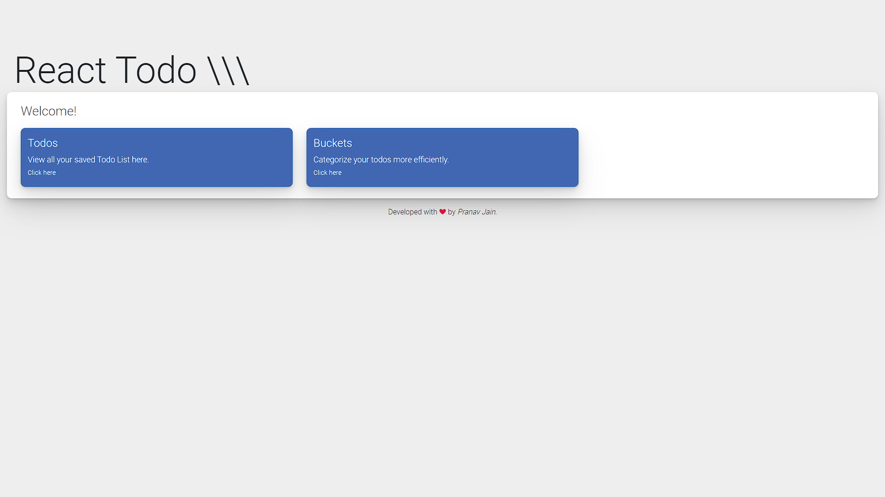
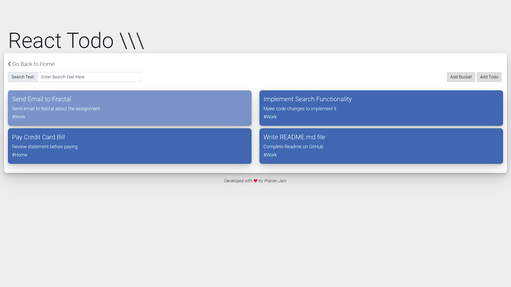
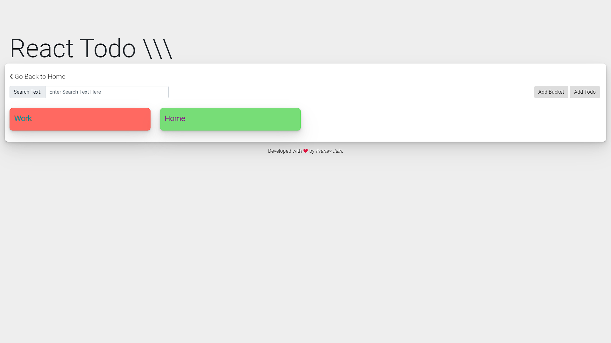
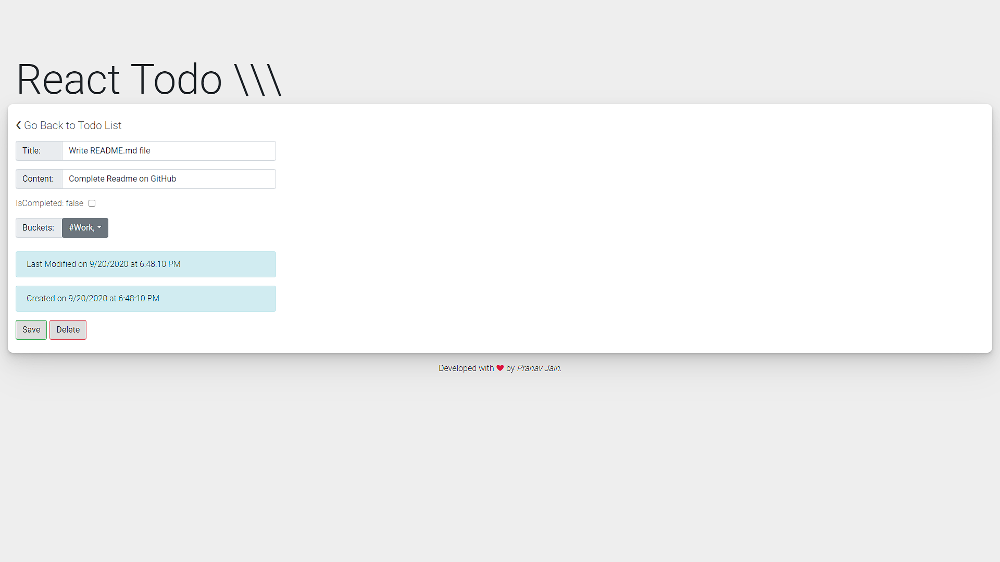

# react-todo

A simple react based Todo Application.

## To get started

To setup this application on your machine. Please follow the guide:
1. Make sure you have Docker installed on your machine. If not then please head over to this [link](https://www.docker.com/get-started) to get started.
2. Take a pull of this Github repo or download the zip.
3. Open Terminal and go to the root folder of the repo that you just downloaded/pulled.
4. Run the command ```docker-compose up --build```
5. That's it!

## Stack

1. Frontend - React, Redux, Thunk, and React-Router
2. Backend - Express
3. Database - PostgreSQL
4. Deployment - Docker
5. CI/CD - Travis CI
6. Cloud Services - AWS Elastic Beanstalk, RDS and S3
7. Test Cases - React testing library

## Pending Work

Following features are not implemented yet
1. Search Functionality
2. Colored Bucket label on Todo
3. More Functionalities...

## Docker Images

You can find the Docker Images link here
1. [React-Todo-Nginx](https://hub.docker.com/r/pranavj1001/react-todo-nginx)
2. [React-Todo-Client](https://hub.docker.com/r/pranavj1001/react-todo-client)
3. [React-Todo-Server](https://hub.docker.com/r/pranavj1001/react-todo-server)

## Screenshots






Note: The project is also hosted on AWS. Since AWS being a paid service, I'm not posting the link here. Send me an email if you want the link to view it.

## Queries?

Email me at pranavj1001@gmail.com

## License

MIT License
